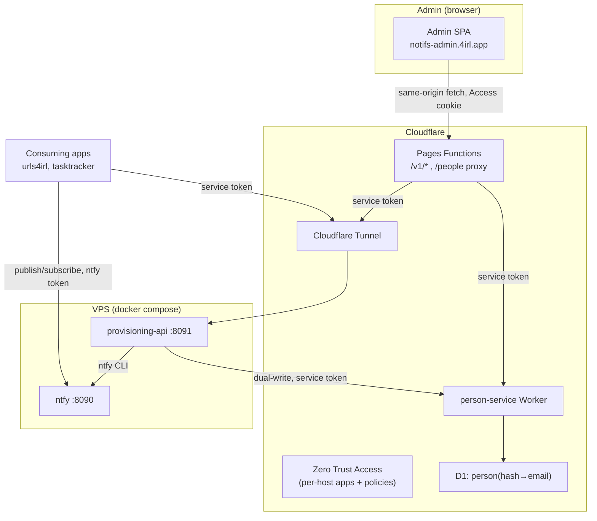
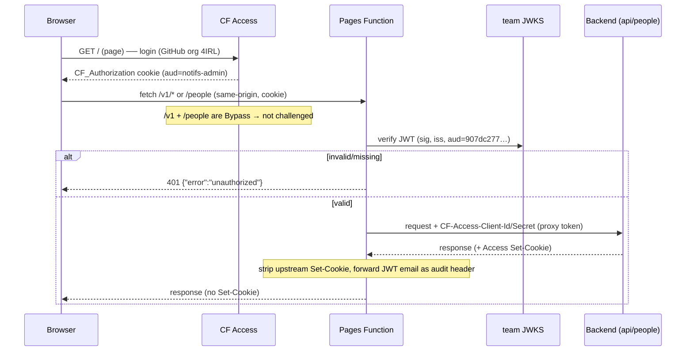
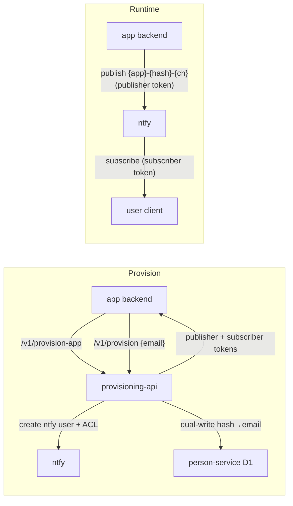
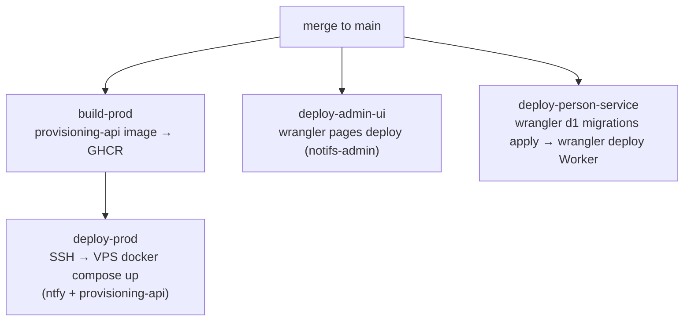

# 4irl-notifs — Architecture

Self-hosted notification hub for the 4IRL app family, built on [ntfy](https://ntfy.sh). Consuming
apps (urls4irl, tasktracker, …) provision users and push **personalized** notifications; end users
receive only their own messages. This doc is the single source of truth for how it works and how it's
wired in Cloudflare — enough to operate and debug it. For how a *client app* integrates, see
[`docs/app-integration-guide.md`](docs/app-integration-guide.md).

## Components

| Component | Tech | Host | Role |
|---|---|---|---|
| **ntfy** | ntfy `v2.26.0`, Docker (VPS) | `notifs.4irl.app` | Pub/sub server. Topics, users, ACLs, tokens. `auth-default-access: deny-all`. |
| **provisioning-api** | Go, Docker (VPS) | `notifs-api.4irl.app` | Creates ntfy users/tokens/ACLs by shelling to the `ntfy` CLI. HTTP API (`/v1/*`). |
| **person-service** | Cloudflare Worker + D1 | `notifs-people.4irl.app` | Reverse index `person_hash → email`. No auth of its own (Access is its boundary). |
| **admin UI** | React/Vite → Cloudflare Pages + Pages Functions | `notifs-admin.4irl.app` | Human console. SPA + same-origin `/v1/*` + `/people` proxy Functions. |

Two live environments: **local** (docker-compose: ntfy + provisioning-api) and **production** (the
VPS + Cloudflare). ntfy + provisioning-api run on the VPS; person-service + admin UI are Cloudflare-native.

## System diagram

## Hosts & DNS (all under the `4irl.app` Cloudflare zone)

| Host | Fronted by | Access-gated? | Origin |
|---|---|---|---|
| `notifs-admin.4irl.app` | Cloudflare Pages | Yes (human login) | Pages project `notifs-admin` |
| `notifs-api.4irl.app` | Tunnel → `127.0.0.1:8091` | Yes (service-token only) | provisioning-api container |
| `notifs.4irl.app` | Tunnel → `127.0.0.1:8090` | **No** (ntfy token auth) | ntfy container |
| `notifs-people.4irl.app` | Worker custom domain | Yes (service-token only) | person-service Worker |

- The Tunnel is a **shared, remotely-managed** connector (also fronts urls4irl); notifs routes were
  added as public hostnames — no new daemon/credential, dashboard-only.
- ntfy is deliberately **not** behind Access (mobile/CLI clients can't do an OAuth redirect); its
  own token auth is the boundary.

---

## Authentication (Cloudflare Zero Trust)

Zero Trust team domain: **`urls4irl.cloudflareaccess.com`** (shared with urls4irl). JWT issuer =
`https://urls4irl.cloudflareaccess.com`; JWKS = `…/cdn-cgi/access/certs`.

### Access applications

| App | Domain(s) | AUD tag | Policy |
|---|---|---|---|
| `notifs-admin` | `notifs-admin.4irl.app` | `907dc277…575f` | `U4I Dev Policy` — **Allow**, GitHub org `4IRL` (human login) |
| `notifs-admin` API bypass | `notifs-admin.4irl.app/v1`, `/people`, `/apps` | — | **Bypass** (Everyone) — Access does NOT gate these paths; the Function authenticates |
| `notifs-api` | `notifs-api.4irl.app` | `91ad97d9…694150` | **Service Auth** (proxy token) only |
| `notifs-people` | `notifs-people.4irl.app` | `5a270164…658f5a` | **Service Auth** (VPS dual-write token + proxy token) only |

- `U4I Dev Policy` is a **reusable** Allow policy shared with `notifs-admin`. On the backends it was
  *detached* (Step-7 lockdown), leaving them service-token-only. Never *delete* it (would break admin login).
- The AUD tag is per-app; `ACCESS_JWT_AUD` on the Pages project must equal `notifs-admin`'s AUD (`907dc277…`).
- ⚠️ **The API-bypass path list is dashboard-managed and must include every same-origin API path.** When a
  new proxied path is added (e.g. `/apps` for the app registry), the operator must add it to this Bypass
  application alongside `/v1` and `/people` — otherwise Access edge-challenges non-GET requests to it
  (`POST`/`PATCH`/`DELETE` → 302 login → 405), exactly the failure in the debugging table below. `GET`
  still works, so the symptom is "list renders but every mutation fails."

### Service tokens

| Token | Presented by | Authorized on |
|---|---|---|
| `notifs-admin-proxy → backends` | Pages Function (`CF-Access-Client-Id/Secret`) | `notifs-api` + `notifs-people` Service Auth |
| VPS dual-write token | provisioning-api (Go) | `notifs-people` Service Auth |
| *(future)* per-consuming-app tokens | urls4irl / tasktracker backends | `notifs-api` Service Auth |

### Admin-UI request flow (the important one)

**Why the design is shaped this way (hard-won, keep):**
- Access **challenges same-origin `fetch` POSTs** (302→login, downgrading POST→GET → 405). Fix: the
  **Bypass** app on `/v1`+`/people` takes those paths off Access's edge; the **Function validates the
  JWT itself** (`web/functions/_auth.ts`).
- The backends' Access **Set-Cookie** (`CF_Authorization` for the service token) must be **stripped**
  by the proxy, or it overwrites the admin's human cookie on `notifs-admin.4irl.app` → 401 loop.
- Auth is **fail-closed**: unset `ACCESS_JWT_AUD` (without the `DISABLE_ACCESS_AUTH=true` local flag)
  → `500`, never open.

---

## Admin-UI same-origin proxy

- SPA calls **relative** `/v1/*`, `/people`, and `/apps` (same-origin) — no cross-origin browser requests.
- `web/functions/`: `_proxy.ts` (shared helper), `v1/[[path]].ts`, `people.ts`, `apps/[[path]].ts`,
  `_auth.ts` (JWT), `_http.ts`. `/v1/*` → provisioning-api; `/people` + `/apps` → person-service.
- Function: validate Access JWT → forward to backend with the proxy service token → strip upstream
  `Set-Cookie` → return. People view gated by `VITE_PEOPLE_ENABLED=true`, Apps view by `VITE_APPS_ENABLED=true`.

**Pages project `notifs-admin` — runtime bindings** (set in dashboard, not committed):

| Binding | Type | Value / purpose |
|---|---|---|
| `PROVISIONING_API_URL` | plaintext | `https://notifs-api.4irl.app` |
| `PERSON_SERVICE_URL` | plaintext | `https://notifs-people.4irl.app` |
| `PROXY_ACCESS_CLIENT_ID` | secret | proxy service token client id |
| `PROXY_ACCESS_CLIENT_SECRET` | secret | proxy service token client secret |
| `ACCESS_TEAM_DOMAIN` | plaintext | `urls4irl.cloudflareaccess.com` (JWKS host + issuer) |
| `ACCESS_JWT_AUD` | plaintext | `notifs-admin` AUD (`907dc277…`) |
| `DISABLE_ACCESS_AUTH` | plaintext | **local dev only** (`true` disables JWT check). Never set in prod. |

Build-time (in `pages-deploy.yml`): `VITE_PEOPLE_ENABLED=true`, `VITE_APPS_ENABLED=true`.

---

## Notification model

- **Identity = email** → `person_hash` (`sha256(trim+lowercase(email))` → base32, 16 chars). Same
  email = same person across every app. ntfy user id = `u_<person_hash>`.
- **Two tokens** (each revealed once at mint):

| Token | Endpoint | ntfy ACL | Held by |
|---|---|---|---|
| **Publisher** | `POST /v1/provision-app {app_id}` | write-only `{app_id}-*` | app backend (one per app) |
| **Subscriber** | `POST /v1/provision {app_id,email}` | read-only `{app_id}-{person_hash}-*` | end-user client |

- **Topics:** `{app_id}-{person_hash}-{channel}` (app picks `{channel}`). Publisher writes any
  `{app_id}-*`; subscriber reads its own `{app_id}-{person_hash}-*`.
- **person-service D1** table `person(person_hash PK, email, created_at)` — reverse index so an
  operator can map an opaque hash back to an email. Populated by the provisioning-api **dual-write**
  (Go) on every `/v1/provision`, and **dual-deleted** on a full user teardown (`DELETE /v1/users/{id}`
  or a deprovision that removes the user's last app).
- **person-service D1** table `app(app_id PK, display_name, description, created_at)` — the first-class
  **app registry**, the operator-facing catalog behind the admin UI's Apps section (list/add/edit/remove).
  It is advisory metadata layered over ntfy's still-derived reality: `POST /v1/provision` does **not**
  require an app to be registered, so the registry and ntfy can diverge (an app with ntfy subscribers but
  no registry row is not shown). The provisioning-api best-effort dual-deletes the row when an app is torn
  down via `POST /v1/deprovision-app`.

### provisioning-api endpoints (`notifs-api.4irl.app`, all Service-Auth gated)

`POST /v1/provision` · `POST /v1/deprovision` · `GET /v1/users` · `DELETE /v1/users/{user_id}` ·
`POST /v1/provision-app` · `POST /v1/deprovision-app` · `GET /healthz`. Bodies + responses are JSON;
errors `{ "error": … }`. Notes: `DELETE /v1/users/{id}` is idempotent (200 even when the ntfy user is
already gone; it also dual-deletes the person row). `POST /v1/provision-app` takes an optional
`rotate` (default false = additive mint; true = revoke existing publisher tokens then mint one).
`POST /v1/deprovision-app {app_id}` fully removes an app (publisher identity + every subscriber grant +
registry row). Full contract: `docs/app-integration-guide.md` + `provisioning-api/internal/httpapi`.

---

## Deploy pipeline

`prod-build-and-deploy.yml` runs on **merge to `main`** and fans out:

- **VPS deploy** (`prod-deploy.yml`): SSH via `cloudflared access ssh` (own SSH key + deploy service
  token), SCPs compose + ntfy config, `docker compose up -d`. Dual-write creds delivered as Docker
  Compose secrets (`PERSON_SERVICE_ACCESS_CLIENT_*`), never a plaintext `.env`.
- **person-service D1 schema** is applied by CI: `worker-deploy.yml` runs `wrangler d1 migrations apply
  person-service --remote` **before** `wrangler deploy`, so a new Worker code path never hits a table its
  migration hasn't created (idempotent — applied migrations are skipped). Adding a table = add a
  `person-service/migrations/NNNN_*.sql` file; no workflow change needed.
- **Pages/Worker deploys**: `wrangler`, auth via repo secrets `CLOUDFLARE_API_TOKEN` (Pages-Edit +
  Workers-Scripts + D1) + `CLOUDFLARE_ACCOUNT_ID`. Worker custom domain is managed **out-of-band** in
  the dashboard (keeps the CI token account-scoped, no zone perms).
- Access apps, policies, service tokens, and Pages bindings are **dashboard-managed** (no Terraform,
  not in CI).

## Debugging quick reference

| Symptom | Likely cause |
|---|---|
| Admin API `500 {"error":"proxy misconfigured"}` | A Pages binding unset/misnamed, or `ACCESS_JWT_AUD` unset in prod (fail-closed). |
| Admin API `502 {"error":"upstream auth failed"}` | Proxy service token not on the backend's Service-Auth policy (or wrong policy action). |
| Admin API `502 {"error":"upstream unreachable"}` | `PROVISIONING_API_URL`/`PERSON_SERVICE_URL` wrong/down, or Tunnel route missing. |
| Admin API `401 {"error":"unauthorized"}` | JWT invalid/missing: `aud`≠`notifs-admin` AUD, wrong `ACCESS_TEAM_DOMAIN`, or expired session. |
| Provisioning/Apps POST/PATCH/DELETE → 302 login / 405 | The path (`/v1`, `/people`, `/apps`) is missing from the Access **Bypass** app → Access is edge-challenging the write. (Apps section lists via GET but every mutation fails until `/apps` is added.) |
| Admin API `500` "no such table: app" | person-service Worker deployed without applying D1 migration 0002 — run `wrangler d1 migrations apply person-service --remote` (CI does this automatically before deploy). |
| Direct browser visit to a backend → 403 | Expected post-lockdown (service-token-only). Rollback = re-add `U4I Dev Policy`. |
| ntfy publish/subscribe 403 | Wrong ntfy token, or topic outside the token's ACL (`{app_id}-*` publisher / `{app_id}-{hash}-*` subscriber). |

**Where to look:** Pages Functions logs (`wrangler pages deployment tail`); Cloudflare Access audit
logs (per-app); VPS `docker compose logs`; provisioning-api emits structured errors server-side (never
leaked to callers).

## Related docs
- `docs/app-integration-guide.md` — how a consuming app integrates (service token → provision → pub/sub).
- `CLAUDE.md` — repo conventions, commands, environments.
- Plans: `~/code/plans/4irl-notifs/completed/admin-ui-same-origin/` (the same-origin redesign + auth model).
